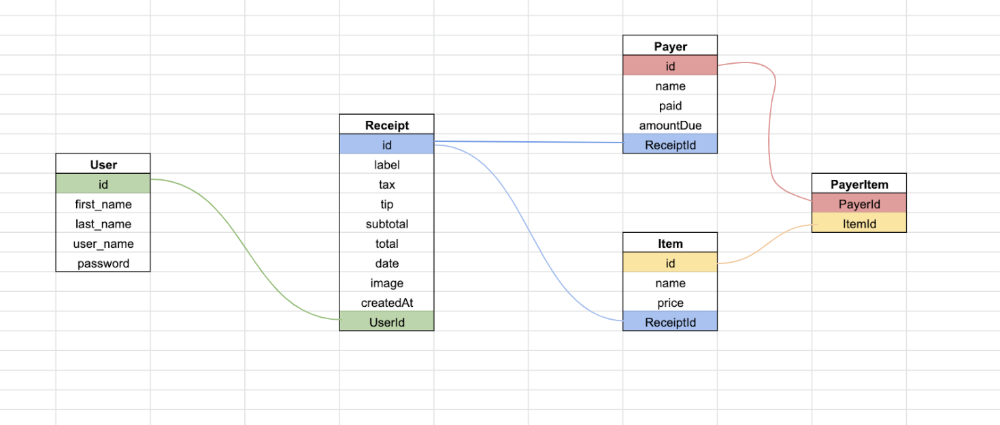
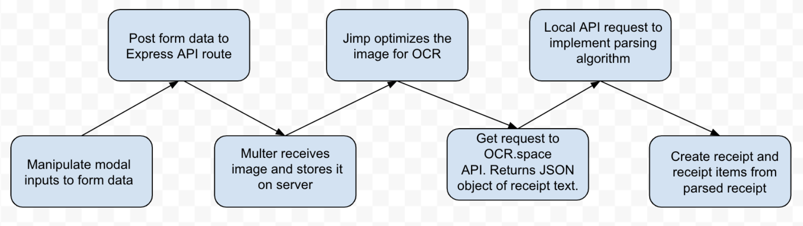

# Splitsy

A full stack web application that uses optical character recognition (OCR) technology to convert a user uploaded receipt image into a virtual receipt. Users can then easily add payers to the virtual receipt and assign items, simplifying the receipt “split up” process. Built with React, Node.js, Express, MySQL, Passport.js and OCR.space API.
<br>

Begin splitting your restaurant bills today! Visit: [https://splitsy.herokuapp.com/](https://splitsy.herokuapp.com/)

## Demo


<br>

## Technologies

### Front End

* ReactJS
  * React-Strap
  * React-chartjs-2
* Bootstrap
* CSS
* Moment.js

### Back End

* NodeJS
* ExpressJS
* MySQL
* Sequelize
* Multer
* Jimp
* OCR.space API
* PassportJS
* BcryptJS
* Axios

## Models


<br>

## OCR Flow



## Authors

### Arman Riahi
* [LinkedIn](https://www.linkedin.com/in/arman-riahi/)
* [GitHub](https://www.github.com/namrataffy)

### Amanda Atkins
* [LinkedIn](https://www.linkedin.com/in/amandalatkins/)
* [GitHub](https://www.github.com/amandalatkins)
* [Portfolio](https://digitalrainstorm.com)
* Contact: [amanda@digitalrainstorm.com](mailto:amanda@digitalrainstorm.com)

## Code Snippet

Code showing parsing for the JSON object returned from OCR.space API:

```javascript
// // Parses OCR response
  app.post("/api/parse", function(req, res) {
    var { text } = req.body;

    var parse = text.split("\n");

    for (var i = 0; i < parse.length; i++) {
      // Replace random characters
      parse[i] = parse[i].replace(/\t\r/g, "");

      // Split the line by 'tabs'
      parse[i] = parse[i].split("\t");
    }

    // checks to see if a line has only one item and the proceeding line also only has one item. then checks if proceeding line is a dollar amount, if so pushes to original item, mimic-ing an item and price
    for (var i = 0; i < parse.length - 1; i++) {
      if (parse[i].length === 1 && parse[i + 1].length === 1) {
        if (parse[i + 1][0].includes("$")) {
          parse[i].push(parse[i + 1][0]);
        }
      }
    }

    //Remove any lines that don't have more than one item (more than 3) OR a dollar sign (nearly all the food items end up having 2 children)
    parse = parse.filter(item => {
      if (item.length > 1 || item.length < 3) {
        return true;
      } else {
        return item.some(child => child.includes("$"));
      }
    });

    //Loop through the array and see if any item in that array contains a $. Keep it if it does.
    var itemArray = [];

    for (var i = 0; i < parse.length; i++) {
      var keep = false;
      parse[i].forEach(item => {
        if (item.includes("$") || item.includes(".")) {
          keep = true;
        }
      });

      if (keep) itemArray.push(parse[i]);
    }

```
